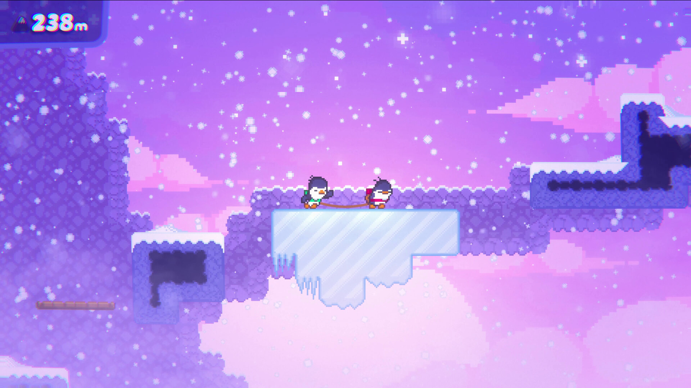

# Jogo
Uma corrida frenética até o topo!  Uma torre misteriosa desafia personagens ágeis em uma competição eletrizante.  Saltos precisos e reflexos rápidos são essenciais para superar as plataformas.  Quem será o primeiro a alcançar o topo e ser coroado campeão?  Prepare-se para uma aventura inesquecível!

## Referências

-[Jump King](https://www.youtube.com/watch?v=qL2cQ0JAb4M)

</img>

-[Only Up](https://www.youtube.com/watch?v=bVFsHqvaI70)

</img>

-[Bread & Fred](https://www.youtube.com/watch?v=l04b1i6W_GQ)

</img>

## Universo

O mundo é Medieval, onde o objetivo é escalar a Torre que consiste em ter paciencia ao escalar, e determinação ao cair;

## Personagens

Dois cavaleiros, onde os dois podem escalar ela unidos, ou atrapalhar um ou outro;

## Regras 

Pulo, Câmera por etapas, Não Morte;

## Objetivo 

Topo da Torre;

## Receitas 

Skins, Compra do jogo;
