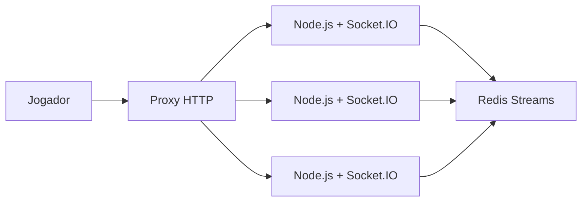

# Feira de Jogos

Escolhas:

- [#1](https://github.com/feira-de-jogos/feira-de-jogos/issues/1) e [#3](https://github.com/feira-de-jogos/feira-de-jogos/issues/3): [Phaser 4 (rc4)](https://phaser.io/news/2025/05/phaser-mega-update)  com [TypeScript](https://www.typescriptlang.org/).
- [#2](https://github.com/feira-de-jogos/feira-de-jogos/issues/2): [Parcel](https://parceljs.org/).
- [#5](https://github.com/feira-de-jogos/feira-de-jogos/issues/5): [Docker Compose](https://docs.docker.com/compose/) com [monitoramento de contêiner](https://docs.docker.com/reference/compose-file/services/#healthcheck).
- [#8](https://github.com/feira-de-jogos/feira-de-jogos/issues/8): [Node.js](https://nodejs.org/).
- [#10](https://github.com/feira-de-jogos/feira-de-jogos/issues/10): cluster [Node.js](https://nodejs.org/) e [Redis Streams](https://redis.io/) via [Redis Streams](https://socket.io/docs/v4/redis-streams-adapter/).
- [#11](https://github.com/feira-de-jogos/feira-de-jogos/issues/11): Sinalização de mídia com [Livekit](https://livekit.io/) e lógica de jogo com [Socket.IO](https://socket.io/).
- [#12](https://github.com/feira-de-jogos/feira-de-jogos/issues/12): SFU com [Livekit](https://livekit.io/).

