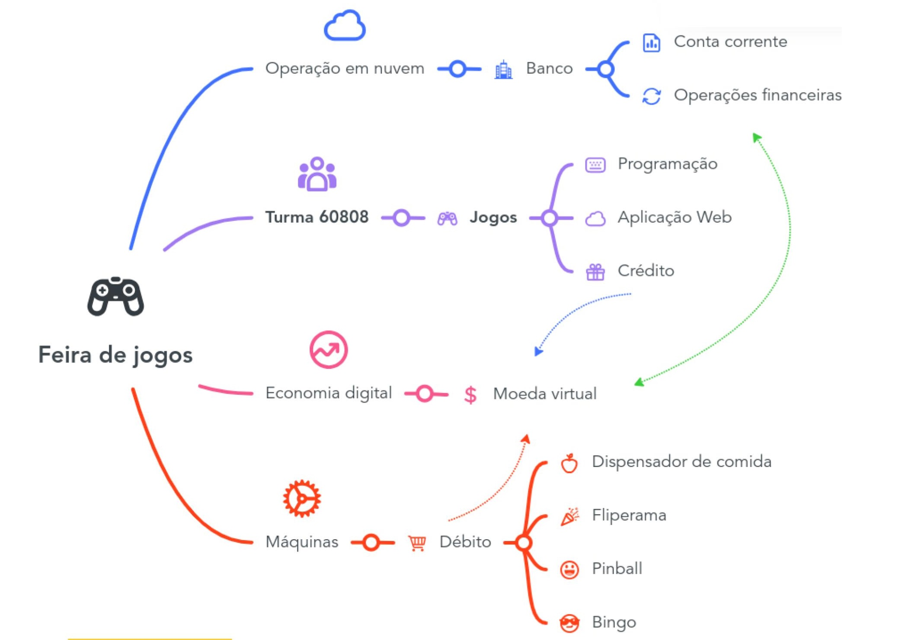

# Sobre a Feira de Jogos

As boas ideias não surgem em escritórios fechados, em horário comercial, sob a luz quase asséptica de lâmpadas fluorescentes.

Foi em um final de tarde, no bar, tomando café, que dois professores resolveram juntar *hardware* e *software* da melhor forma: com jogos, claro.

Assim, surgiu a Feira de Jogos, um projeto de ensino e pesquisa para apresentar ao mundo os jogos desenvolvidos no último semestre do Ensino Integrado ao Médio em Telecomunicações do Instituo Federal de Santa Catarina campus São José.

Nos anos anteriores, já havia os jogos, mas faltava  atrair o público. Uma inovação em relação aos anos anteriores foi que cada jogo, uma vez terminado, rende dinheiro virtual, os **Tijolinhos** (**$TJL**), para serem gastos na Feira: troca de brindes e doces, jogos antigos na *lanhouse* etc.

Foi preciso, assim, pensar na [economia](economia.md) da Feira, bem como nos [serviços](serviços.md) e padrões para manter todo o evento. Segue o mapa mental da ideia geral:

Como o projeto depende de financiamento, devido a bolsas de pesquisa e custos de produção e operação (compra dos brindes, material para as máquinas e outros), foi projetado um modelo simples para o segundo semestre de 2023, denominado [**versão 1**](v1/README.md). Várias melhorias foram feitas para o semestre seguinte, no início de 2024 - a [**versão 2**](v2/README.md). Em atual desenvolvimento, a versão [3](v3/README.md).

## *Tags* e Versões

As *tags* se referem a determinados *commits*, já as versões (*releases*) se destinam a identificar versões de produção para serem usadas nas feiras de jogos.

Prefixo de *tags*:

- `3d`: projetos 3D para dispositivos físicos, como estações meteorológicas e outros.
- `hw`: projeto elétrico (esquemáticos etc.) e código fonte para embarcados.
- `sw`: código fonte para *frontend* e *backend*, bem como implantação e serviços de nuvem.
- `v`: versões de produção. No GitHub, será usado para as *releases*.

Para sufixo de *tags*, será adotado o [versionamento semântico](https://semver.org/lang/pt-BR/).

Exemplos:

- `hw0.1.0`: primeira versão de teste de * hardware*.
- `sw2.0.0`: segunda versão de produção de * software*, sem retrocompatibilidade com a versão anterior.
- `v3.0.0`: terceira versão de produção.