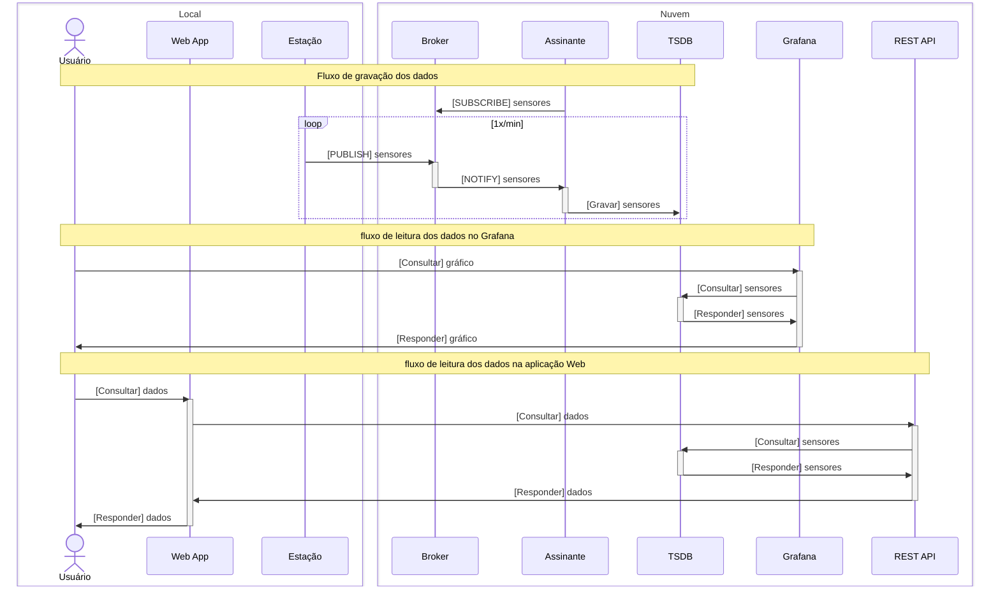

# Estações Meteorológicas

## Estrutura Física

O bom funcionamento de uma estação meteorológica está diretamente relacionado à adequação da sua estrutura física.

Em nível internacional, a Organização Meteorológica Mundial (WMO) estabelece normas para instrumentos e métodos de observação meteorológicas. O propósito dessas orientações é padronizar a aquisição de dados meteorológicos para torná-los mais confiáveis e comparáveis.

As normas da WMO podem ser encontradas no link: [Guide to Instruments and Methods of Observation (WMO-No. 8)](https://library.wmo.int/viewer/68695/?offset=3#page=115&viewer=picture&o=bookmark&n=0&q=).

No que tange as características da estrutura do equipamento meteorológico em si, as principais exigências para medição de temperatura, pressão atmosférica e umidade envolvem:

- Instalação a pelo menos 1,2m de altura do solo.

- Coloração branca para minimizar os efeitos da radiação solar.

- Colocação dos sensores em abrigos meteorológicos (ex. tela de Stevenson) para evitar incidência direta de luz, vento ou precipitações (exceto equipamentos que dependem desses parâmetros, como pluviômetros).

- Disponibilidade permanente de energia elétrica.

Sobre o local de colocação da estação meteorológica, as principais recomendações são:

- O local deve ser plano e o mais afastado possível de obstáculos. Idealmente, a distância da estação em relação a obstáculos deve ser pelo menos 10 vezes a altura do maior obstáculo.

- O piso deve apresentar grama ou outra vegetação rasteira para minimizar efeitos da textura do solo.

- Deve-se evitar áreas escuras para minimizar a influência do aquecimento da superfície.

1. Materiais para construção dos componentes da estação meteorológica

Na presente etapa, a estrutura da estação meteorológica é composta pelos seguintes elementos:

- Abrigo para NodeMCU;
- Abrigo para sensores meteorológicos (tela de Stevenson);
- Pluviômetro;
- Haste de suporte para equipamentos.

A construção da haste de suporte será feita com canos de PVC sanitário.

Para a construção dos abrigos e do pluviômetro, optou-se pela impressão 3D. Para isso, utilizou-se uma impressora Bambu Lab A1 Mini.
Os protótipos foram em impressos com filamentos PLA (ácido polilático), um polímero biodegradável feito a partir de vegetais. Além de ser sustentável, o PLA é também mais barato.
As peças definitivas serão impressas com filamentos PETG (Polietileno Tereftalato Glicol), um termoplástico que, apesar de ser derivado de petróleo, apresenta maior resistência mecânica e térmica.

2. Desenho dos componentes

Os desenhos dos componentes foram pesquisados repositórios de compartilhamento de trabalhos com impressoras 3D, como Thingiverse e Maker World. Após avaliar os projetos disponíveis, foram selecionados os seguintes projetos:

- [Weather station : Solar powered rain gauge - Pluviometer V2](https://www.thingiverse.com/thing:6958200)

- [IoT Weather Station](https://www.thingiverse.com/thing:1985125)

- [ESP8266 Weather Station with MQTT](https://www.thingiverse.com/thing:3884183)

- [LTB Weather Station](https://www.thingiverse.com/thing:2849562)
https://www.thingiverse.com/thing:2849562

## Fluxo de Mensagens

Para as estações meteorológicas, o fluxo é  o seguinte:



- [#45](https://github.com/feira-de-jogos/feira-de-jogos/issues/45): o formato das mensagens das estações para o *broker* é baseado no [*line protocol* do InfluxDB, versão 2](https://docs.influxdata.com/influxdb/v2/reference/syntax/line-protocol/):

- Tópico: `em/<uuid>`, onde `<uuid>` é o identificador da estação;
- Mensagem: `em/<uuid>,v=<versão>,lat=<lat>,lng=<longitude>,alt=<altitude> <chave1>=<valor1>,<chave1>=<valor1>,...,<chaveN>=<valorN> <ns_timestamp>`, onde:
  - `<uuid>`: identificador da estação;
  - `<versão>`: versão da estação em inteiros (0, 1 etc.);
  - `<lat>`: latitude da estação;
  - `<lng>`: longitude da estação;
  - `<alt>`: altitude da estação;
  - `<chave>`: nome do atributo a ser armazenado;
  - `<valor>`: valor do atributo a ser armazenado;
  - `<ns_timestamp>`: UNIX timestamp em nanossegundos.
  
  Exemplo:
  
  ```text
  Tópico: em/8364DE0C-2534-431A-B6A2-965569C3EE52
  Mensagem: 8364DE0C-2534-431A-B6A2-965569C3EE52,v=1,lat=-27.608574,lng=-48.633181,alt=57 temperatura=17,umidade=76.4 1751665693000000000
  ```

Para visualizar os dados: [painel do Grafana](https://grafana.feira-de-jogos.dev.br/public-dashboards/7957a49460e34d0f8a41f393526cf09b).
