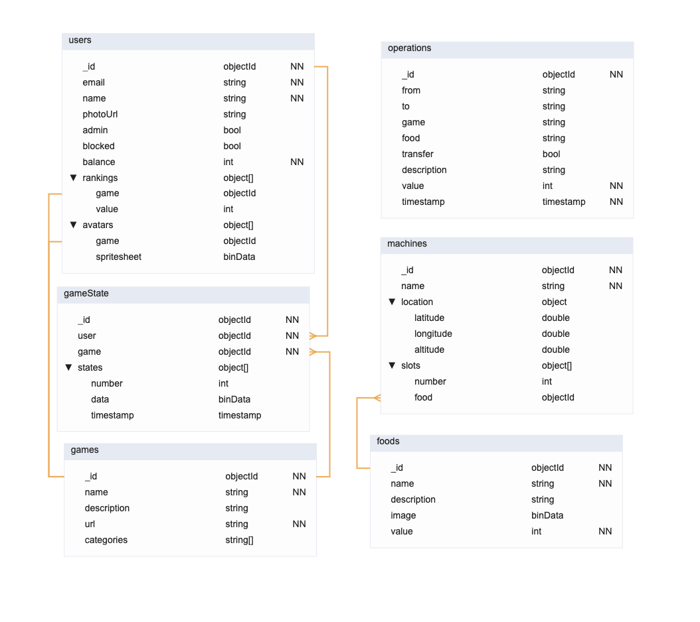

# Banco de dados

Esquema do banco de dados não relacional:



```js
db.createCollection("operations", {
  validator: {
    $jsonSchema: {
      bsonType: "object",
      title: "operations",
      required: ["_id", "value", "timestamp"],
      properties: {
        "_id": { bsonType: "objectId" },
        "from": { bsonType: "string" },
        "to": { bsonType: "string" },
        "game": { bsonType: "string" },
        "food": { bsonType: "string" },
        "transfer": { bsonType: "bool" },
        "description": { bsonType: "string" },
        "value": { bsonType: "int" },
        "timestamp": { bsonType: "timestamp" },
      },
    },
  },
});

db.createCollection("users", {
  validator: {
    $jsonSchema: {
      bsonType: "object",
      title: "users",
      required: ["_id", "email", "name", "balance"],
      properties: {
        "_id": { bsonType: "objectId" },
        "email": { bsonType: "string" },
        "name": { bsonType: "string" },
        "photoUrl": { bsonType: "string" },
        "admin": { bsonType: "bool" },
        "blocked": { bsonType: "bool" },
        "balance": { bsonType: "int" },
        "rankings": { bsonType: "array", items: { bsonType: "object" } },
        "avatars": { bsonType: "array", items: { bsonType: "object" } },
      },
    },
  },
});

db.createCollection("games", {
  validator: {
    $jsonSchema: {
      bsonType: "object",
      title: "games",
      required: ["_id", "name", "url"],
      properties: {
        "_id": { bsonType: "objectId" },
        "name": { bsonType: "string" },
        "description": { bsonType: "string" },
        "url": { bsonType: "string" },
        "categories": { bsonType: "array", items: { bsonType: "string" } },
      },
    },
  },
});

db.createCollection("gameState", {
  validator: {
    $jsonSchema: {
      bsonType: "object",
      title: "gameState",
      required: ["_id", "user", "game"],
      properties: {
        "_id": { bsonType: "objectId" },
        "user": { bsonType: "objectId" },
        "game": { bsonType: "objectId" },
        "states": { bsonType: "array", items: { bsonType: "object" } },
      },
    },
  },
});

db.createCollection("machines", {
  validator: {
    $jsonSchema: {
      bsonType: "object",
      title: "machines",
      required: ["_id", "name"],
      properties: {
        "_id": { bsonType: "objectId" },
        "name": { bsonType: "string" },
        "location": { bsonType: "object", title: "location", properties: { "latitude": { bsonType: "double" }, "longitude": { bsonType: "double" }, "altitude": { bsonType: "double" }, }, },
        "slots": { bsonType: "array", items: { bsonType: "object" } },
      },
    },
  },
});

db.createCollection("foods", {
  validator: {
    $jsonSchema: {
      bsonType: "object",
      title: "foods",
      required: ["_id", "name", "value"],
      properties: {
        "_id": { bsonType: "objectId" },
        "name": { bsonType: "string" },
        "description": { bsonType: "string" },
        "image": { bsonType: "binData" },
        "value": { bsonType: "int" },
      },
    },
  },
});
```
