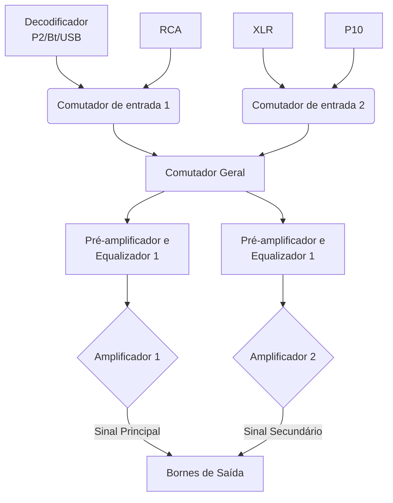

# Mesa de Som
Projeto de uma mesa de som totalmente funcional com controles de áudio (equalização, amplificação, etc) e dispositivos de controle IoT. Ele foi iniciado a partir de uma solicitação da 8ª fase do semestre 2025.2. 

### Esboço da arquitetura de áudio: 
