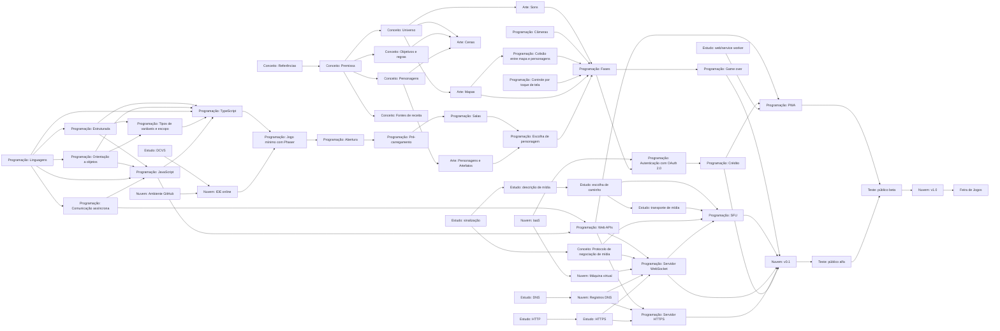

# Fluxograma de tarefas do projeto

```mermaid
flowchart LR

kSw[Programação: Linguagens]
pFT[Programação: Comunicação assíncrona]
npD[Programação: Estruturada]
nTP[Programação: Orientação a objetos]
lTu[Programação: Tipos de variáveis e escopo]
mEy[Programação: JavaScript]
hgR[Programação: TypeScript]
ASw[Programação: Web APIs]

zAt[Programação: Jogo mínimo com Phaser]
LAz[Programação: Controle por toque de tela]
sKg[Programação: Colisão entre mapa e personagens]
sdz[Programação: Câmeras]
KEi[Programação: Abertura]
Nlq[Programação: Pré-carregamento]
rwz[Programação: Salas]
UHj[Programação: Escolha de personagem]
bLw[Programação: Fases]
Brs[Programação: Autenticação com OAuth 2.0]
CMy[Programação: Crédito]
RsJ[Programação: Game over]
ZfY[Programação: Servidor WebSocket]
VFX[Programação: SFU]
mwl[Programação: Servidor HTTPS]
ORs[Programação: PWA]

wfO[Conceito: Premissa]
cwS[Conceito: Referências]
izL[Conceito: Universo]
YfE[Conceito: Objetivos e regras]
FAL[Conceito: Fontes de receita]
Tkd[Conceito: Personagens]
Gds[Conceito: Protocolo de negociação de mídia]

KTG[Arte: Cenas]
FgO[Arte: Mapas]
zwi[Arte: Personagens e Artefatos]
NGi[Arte: Sons]

MeG[Nuvem: Ambiente GitHub]
Zml[Nuvem: IDE online]
IyR[Nuvem: Registros DNS]
ppc[Nuvem: IaaS]
xqW[Nuvem: Máquina virtual]
EaO[Nuvem: v0.1]
LFm[Nuvem: v1.0]

qIo[Estudo: DCVS]
aID[Estudo: DNS]
qSk[Estudo: HTTP]
SCN[Estudo: HTTPS]
xsS[Estudo: sinalização]
Auj[Estudo: descrição de mídia]
dva[Estudo: escolha de caminho]
nDd[Estudo: transporte de mídia]
DYr[Estudo: web/service worker]

mUU[Teste: público alfa]
EQu[Teste: público beta]

HFN[Feira de Jogos]

kSw --> pFT
npD --> mEy
nTP --> mEy
npD --> hgR
nTP --> hgR
npD --> lTu
nTP --> lTu
kSw --> mEy
kSw --> hgR
pFT --> mEy
pFT --> ASw
kSw --> npD
kSw --> nTP
lTu --> hgR
mEy --> ASw
ASw --> ZfY
ASw --> mwl
ASw --> ORs
mEy --> hgR
hgR --> zAt
LFm --> HFN
EQu --> LFm
ORs --> EQu
mUU --> EQu
EaO --> mUU
RsJ --> EaO
VFX --> EaO
ZfY --> EaO
mwl --> EaO
CMy --> EaO
CMy --> ORs
DYr --> ORs
ppc --> Brs
Brs --> CMy
bLw --> Brs
bLw --> RsJ
izL --> NGi
dva --> VFX
Gds --> ZfY
ppc --> xqW
xqW --> ZfY
IyR --> mwl
IyR --> ZfY
SCN --> mwl
nDd --> VFX
Gds --> VFX
ZfY --> VFX
SCN --> ZfY
dva --> nDd
Auj --> dva
xsS --> Auj
NGi --> bLw
xsS --> Gds
sdz --> bLw
FgO --> sKg
sKg --> bLw
LAz --> bLw
aID --> IyR
FgO --> bLw
cwS --> wfO
wfO --> izL
wfO --> YfE
wfO --> FAL
qIo --> Zml 
Zml --> zAt
izL --> KTG
YfE --> KTG
zAt --> KEi
MeG --> Zml
wfO --> Tkd
izL --> FgO
KEi --> Nlq
Tkd --> KTG
Tkd --> zwi
Nlq --> rwz
rwz --> UHj
UHj --> bLw
zwi --> UHj
qSk --> SCN
```