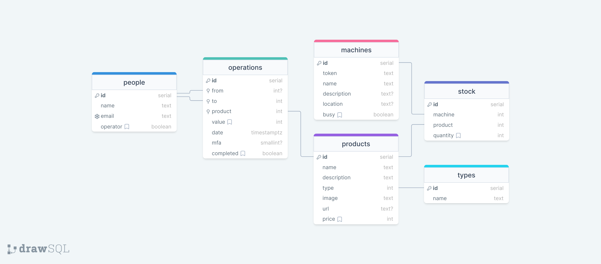

# Versão 2

Implementação baseada em [OAuth 2.0](https://datatracker.ietf.org/doc/html/rfc6749) e [JWT](https://datatracker.ietf.org/doc/html/rfc7519).

## REST API

## Banco de dados relacional

O banco está assim modelado (copiado do [original](https://drawsql.app/teams/feira-de-jogos/diagrams/feira-de-jogos-v2)):



Para PostgreSQL, o código fica assim:

```sql
CREATE TABLE people(
    id SERIAL NOT NULL,
    name TEXT NOT NULL,
    email TEXT NOT NULL,
    operator BOOLEAN NOT NULL DEFAULT '0'
);
ALTER TABLE people ADD PRIMARY KEY(id);
ALTER TABLE people ADD CONSTRAINT people_email_unique UNIQUE(email);

CREATE TABLE machines(
    id SERIAL NOT NULL,
    token TEXT NOT NULL,
    name TEXT NOT NULL,
    description TEXT NULL,
    location TEXT NULL,
    busy BOOLEAN NOT NULL DEFAULT '0'
);
ALTER TABLE machines ADD PRIMARY KEY(id);

CREATE TABLE types(
    id SERIAL NOT NULL,
    name TEXT NOT NULL
);
ALTER TABLE types ADD PRIMARY KEY(id);

CREATE TABLE operations(
    id SERIAL NOT NULL,
    from INTEGER NULL,
    to INTEGER NOT NULL,
    product INTEGER NOT NULL,
    value INTEGER NOT NULL DEFAULT '0',
    date TIMESTAMP(0) WITH TIME zone NOT NULL,
    mfa SMALLINT NULL,
    completed BOOLEAN NOT NULL DEFAULT '0'
);
ALTER TABLE operations ADD PRIMARY KEY(id);
CREATE INDEX operations_from_index ON operations(from);
CREATE INDEX operations_to_index ON operations(to);
CREATE INDEX operations_product_index ON operations(product);

CREATE TABLE stock(
    id SERIAL NOT NULL,
    machine INTEGER NOT NULL,
    product INTEGER NOT NULL,
    quantity INTEGER NOT NULL DEFAULT '0'
);
ALTER TABLE stock ADD PRIMARY KEY(id);

CREATE TABLE products(
    id SERIAL NOT NULL,
    name TEXT NOT NULL,
    description TEXT NOT NULL,
    type INTEGER NOT NULL,
    image TEXT NOT NULL,
    url TEXT NULL,
    price INTEGER NOT NULL DEFAULT '0'
);
ALTER TABLE products ADD PRIMARY KEY(id);

ALTER TABLE stock ADD CONSTRAINT stock_product_foreign FOREIGN KEY(product) REFERENCES products(id);
ALTER TABLE operations ADD CONSTRAINT operations_from_foreign FOREIGN KEY(from) REFERENCES people(id);
ALTER TABLE products ADD CONSTRAINT products_type_foreign FOREIGN KEY(type) REFERENCES types(id);
ALTER TABLE operations ADD CONSTRAINT operations_product_foreign FOREIGN KEY(product) REFERENCES products(id);
ALTER TABLE stock ADD CONSTRAINT stock_machine_foreign FOREIGN KEY(machine) REFERENCES machines(id);
ALTER TABLE operations ADD CONSTRAINT operations_to_foreign FOREIGN KEY(to) REFERENCES people(id);
```

Criação do Banco Central e produção de moeda:

```sql
INSERT INTO people(name, email, operator) VALUES (true, 'Banco Central', 'feiradejogosifscsaojose@gmail.com', true);
INSERT INTO operations(to, value, date, completed) VALUES ((SELECT id FROM people WHERE name = 'Banco Central'), 1000000, NOW(), true);
```
