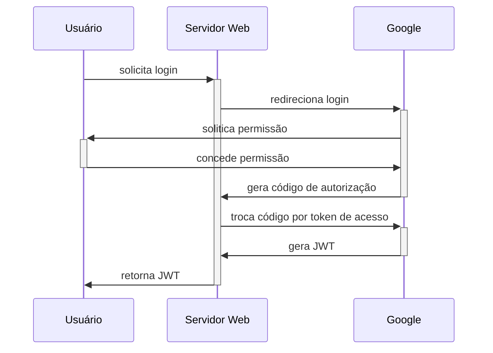
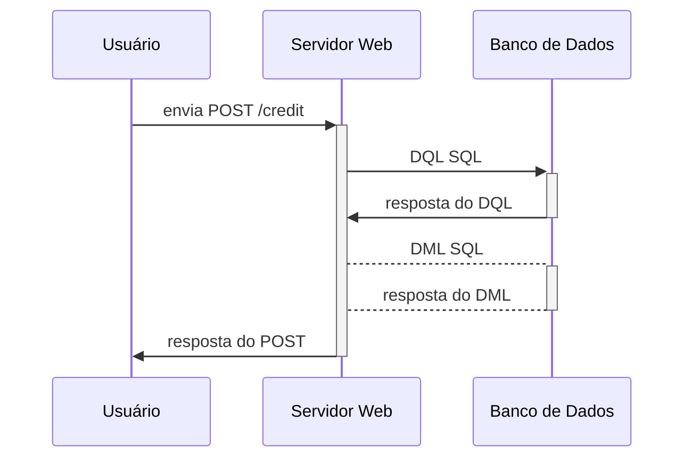
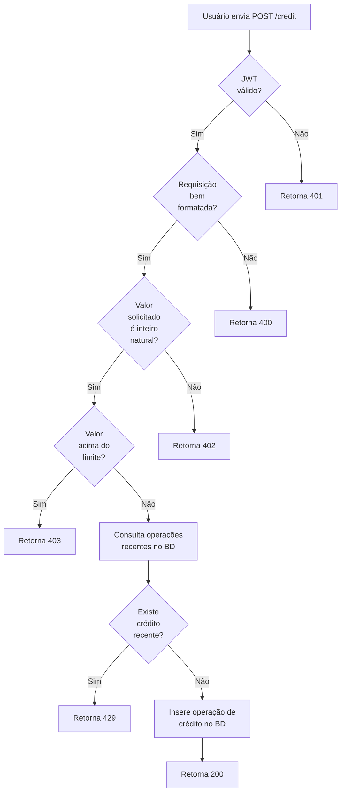
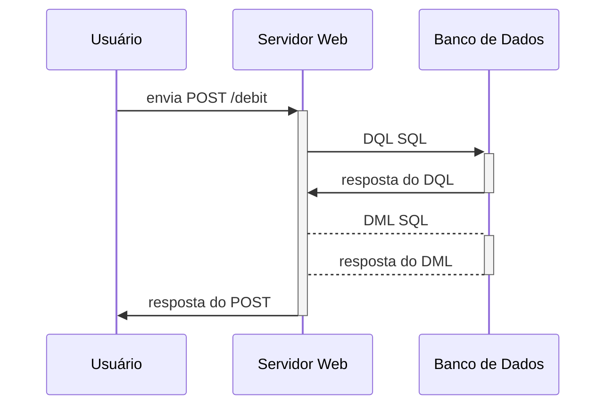
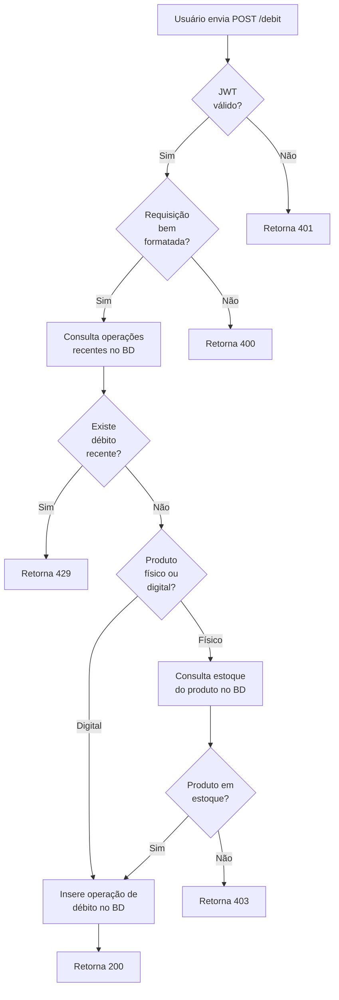
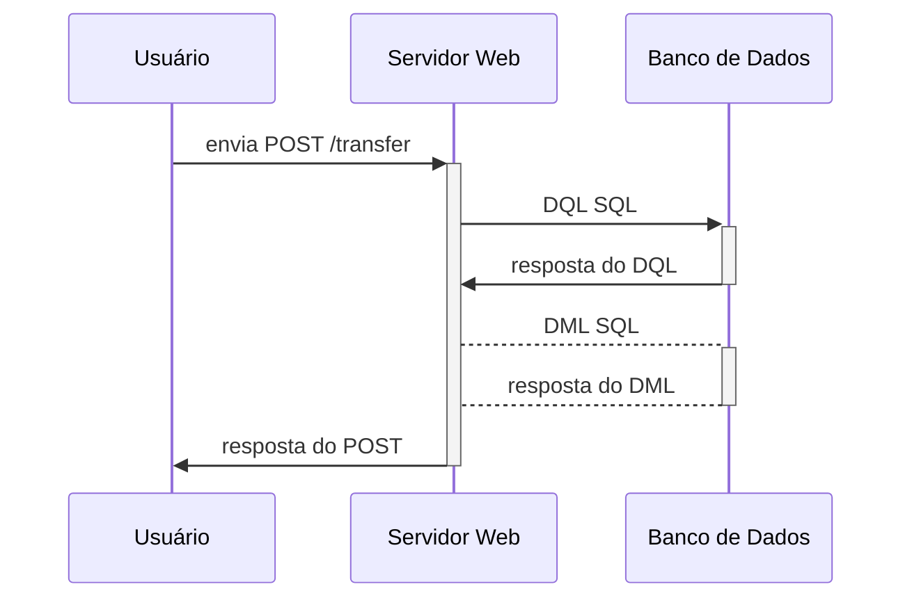
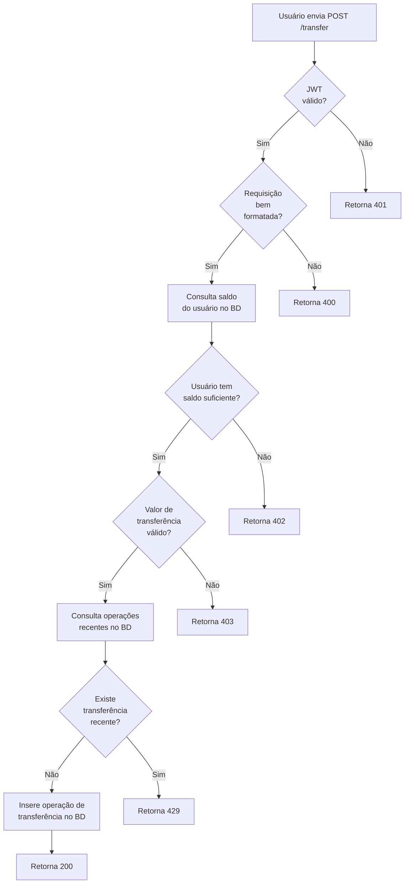
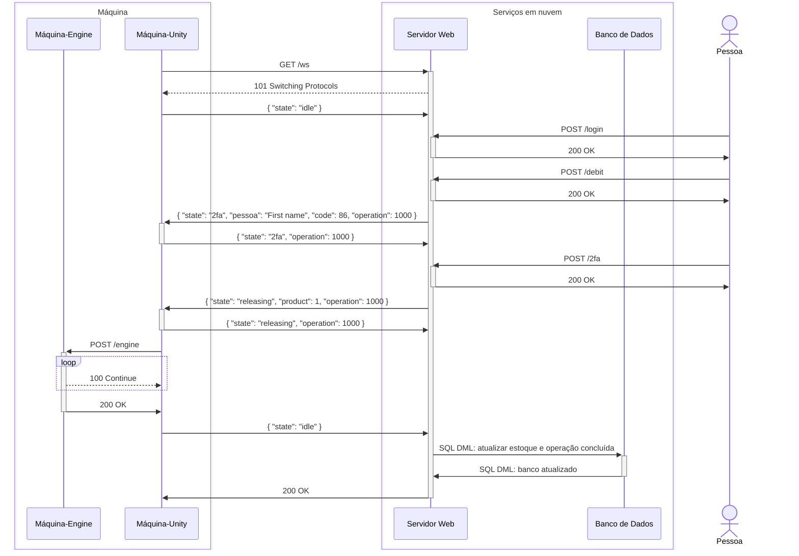

# Versão 2

Implementação baseada em [OAuth 2.0](https://datatracker.ietf.org/doc/html/rfc6749) e [JWT](https://datatracker.ietf.org/doc/html/rfc7519).

## Requisitos do sistema

Requisitos funcionais:

1. O sistema deve possuir acesso a partir de qualquer endereço IPv4 ou IPv6.
1. O sistema deve atender a requisições pela Internet via padrões REST API sobre HTTPS.
1. O sistema deve prever uma interface de usuário para cadastro e manutenção da sua conta.
1. A autenticação de usuário, incluindo o cadastro, deve ser feito via [O Auth 2.0](https://oauth.net/2/).
1. O sistema deve possuir um banco de dados central para persistência dos dados.
1. O sistema deve prever mecanismos de sincronização bidirecional para a sincronização dos dados do banco central e terminais.
1. O banco de dados deve armazenar dados de usuário, dispositivos terminais e produtos para venda.

Requisitos não funcionais:

1. O sistema deve ter suporte a escalabilidade para atender a picos momentâneos de demanda.

O acesso é padronizado para microprocessados (aplicações Web) e microcontrolados, baseado em REST API + JSON, uma vez que o sentido das mensagens é, basicamente, do cliente para o servidor.

As aplicações a serem desenvolvidas ao longo do projeto são:

- **Cadastro**: cadastro e manutenção de conta de usuário;
- **Banco**: operador financeiro, o banco do sistema econômico.

## Trocas de Mensagens e Fluxogramas

### Autenticação via O Auth 2.0

Entre as aplicações em rede:

## Operação de crédito

Entre as aplicações em rede:

Fluxo de escolha do servidor Web na resposta à requisição do usuário:

### Operação de débito

Fluxo de escolha do servidor Web na resposta à requisição do usuário:

### Operação de transferência

Fluxo de escolha do servidor Web na resposta à requisição do usuário:

### Interação com Máquina de Vendas

## REST API

A REST API está definida no arquivo [rest-api.yaml](rest-api.yaml) em formato [OpenAPI 3.0](https://swagger.io/specification/v3/).

## Banco de dados relacional

O banco está assim modelado (copiado do [original](https://drawsql.app/teams/feira-de-jogos/diagrams/feira-de-jogos-v2)):

Para PostgreSQL, os comandos DDL estão no arquivo [ddl.sql](ddl.sql).
Já os comandos DML estão no arquivo [dml.sql](dml.sql).
